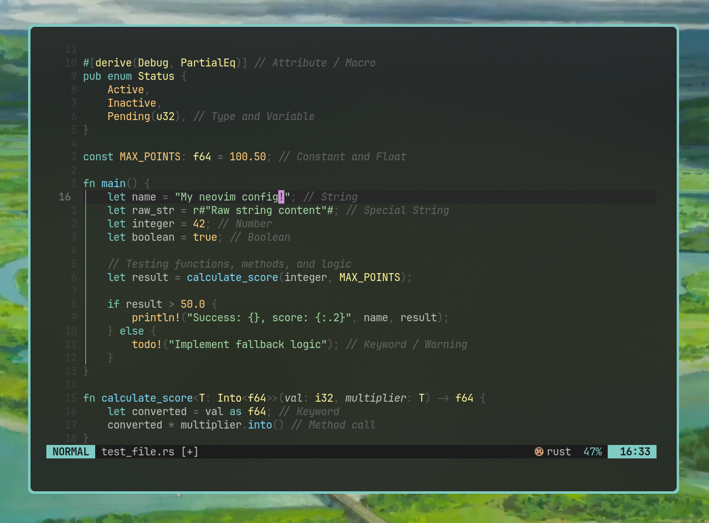

# nvim

> a minimal, aesthetic neovim config built around the meloworld color palette.

---

## overview



my personal neovim configuration. uses meloworld's colorscheme!

## structure

```
nvim/
├── init.lua
└── lua/
    ├── config/
    │   ├── options.lua       — editor settings
    │   ├── keymaps.lua       — keybindings
    │   └── lazy.lua          — plugin manager bootstrap
    ├── themes/
    │   └── meloworld.lua     — custom colorscheme
    └── plugins/
        ├── treesitter.lua    — syntax highlighting
        ├── lualine.lua       — statusline
        ├── telescope.lua     — fuzzy finder
        ├── neo-tree.lua      — file tree
        ├── gitsigns.lua      — git indicators
        ├── lsp.lua           — lsp + mason
        ├── completion.lua    — blink.cmp autocompletion
        ├── formatting.lua    — conform.nvim format on save
        ├── autopairs.lua     — auto close brackets
        ├── markdown.lua      — render-markdown
        ├── which-key.lua     — keymap hints
        └── indent.lua        — indent guides
        ├── smear-cursor.lua  — animated cursor
        ├── neoscroll.lua     — smooth scrolling
        ├── undo-glow.lua     — animated undo/redo/yank/paste
        └── glow.lua          — markdown floating preview
```

## requirements

- [neovim](https://neovim.io/) >= 0.12
- [tree-sitter-cli](https://github.com/tree-sitter/tree-sitter) >= 0.26.1
- [ripgrep](https://github.com/BurntSushi/ripgrep) (for telescope live grep)
- [wl-clipboard](https://github.com/bugaevc/wl-clipboard) (wayland clipboard)
- a [nerd font](https://www.nerdfonts.com/) — config uses JetBrainsMono Nerd Font
- [glow](https://github.com/charmbracelet/glow) — for glow.nvim markdown preview

## install

```bash
git clone https://github.com/melatonia/nvim.git ~/.config/nvim
nvim  # lazy.nvim will auto-install everything on first launch
```

## keymaps

leader key is `space`.

| key               | action             |
| ----------------- | ------------------ |
| `<leader>ff`      | find files         |
| `<leader>fg`      | live grep          |
| `<leader>fb`      | find buffers       |
| `<leader>e`       | toggle file tree   |
| `<leader>x`       | close buffer       |
| `<S-l>` / `<S-h>` | next / prev buffer |
| `<leader>gs`      | stage hunk         |
| `<leader>gp`      | preview hunk       |
| `<leader>gb`      | toggle git blame   |
| `gd`              | go to definition   |
| `gr`              | find references    |
| `K`               | hover docs         |
| `<leader>ca`      | code action        |
| `<leader>rn`      | rename symbol      |
| `<C-d>` / `<C-u>` | scroll centered    |

## language servers

managed via mason. installed automatically on first launch:

`lua_ls` `clangd` `rust_analyzer` `html` `cssls` `ts_ls` `pyright` `bashls` `jsonls` `yamlls`

## formatters

`stylua` `black` `prettier` `clang-format` `shfmt` `rustfmt`

## theme

my custom colorscheme — `meloworld` — placed in `lua/themes/meloworld.lua
